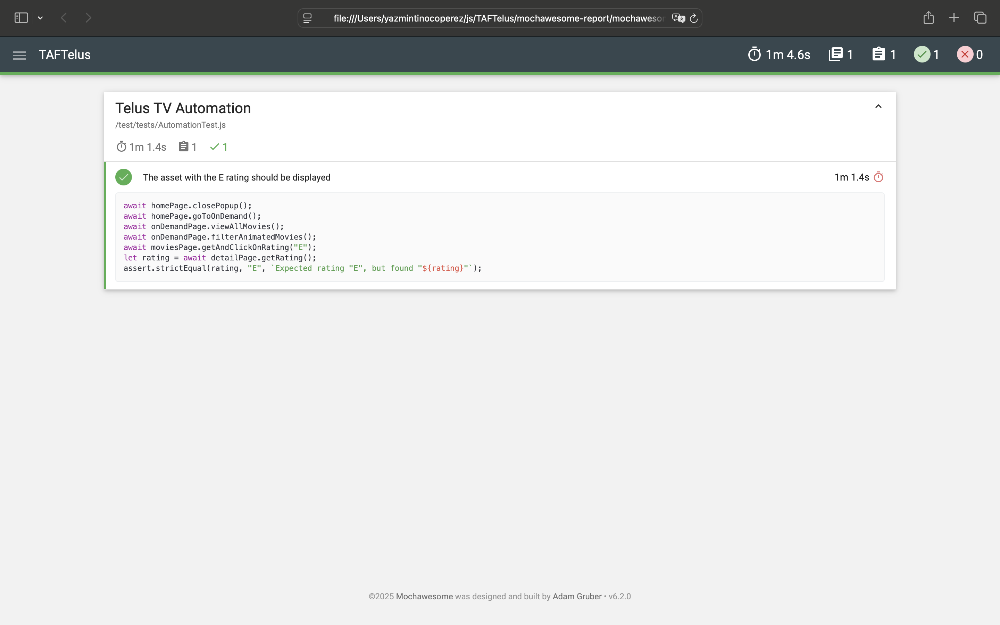

# TAFTelus Automation Framework

This is a Selenium-based Test Automation Framework (TAF) for testing the Telus TV platform. The framework is built using Node.js, Selenium WebDriver, and Mocha as the test runner.

## Prerequisites

Before running the project locally, ensure you have the following installed:

1. **Node.js** (v14 or higher)  
   [Download Node.js](https://nodejs.org/)

2. **Google Chrome** (latest version)  
   [Download Chrome](https://www.google.com/chrome/)

3. **ChromeDriver** (compatible with your Chrome version)  
   [Download ChromeDriver](https://sites.google.com/chromium.org/driver/)

4. **Git** (optional, for cloning the repository)  
   [Download Git](https://git-scm.com/)

---

## Setup Instructions

Follow these steps to set up and run the project locally:

### 1. Clone the Repository

If you haven't already cloned the repository, run the following command:

```bash
git clone https://github.com/Yazmin30-bot/TAFTelus.git
```

### 2. Install dependencies

Open the project using Visual Studio Code and in the terminal run the following command:

```bash
npm install
```

### 3. Run the test case

Run the following command:

```bash
npm test
```

### 4. Check the report generated

On the folder mochawesome-report You will find the HTML and JSON report file





